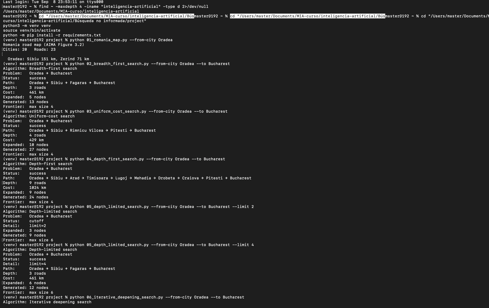

# Ejercicio 1 — Búsqueda no informada: Oradea → Bucharest

## 1. Pareja origen–destino

**Oradea → Bucharest** (una de las parejas sugeridas por el profesor, distinta del caso por defecto Arad → Bucharest).

## 2. Diagrama del subgrafo

Ciudades y aristas (con km) que aparecen en los caminos obtenidos por los 5 algoritmos:

```
Oradea --151-- Sibiu --99-- Fagaras --211-- Bucharest
                 |                              |
                80                             101
                 |                              |
          Rimnicu Vilcea --97-- Pitesti --------+
                                    |
                                  138
                                    |
                                 Craiova --120-- Drobeta --75-- Mehadia --70-- Lugoj --111-- Timisoara --118-- Arad --140-- Sibiu
```

- Camino de **BFS / DLS(lim=4) / IDS**: Oradea → Sibiu → Fagaras → Bucharest (151 + 99 + 211 = 461 km)
- Camino de **UCS**: Oradea → Sibiu → Rimnicu Vilcea → Pitesti → Bucharest (151 + 80 + 97 + 101 = 429 km)
- Camino de **DFS**: Oradea → Sibiu → Arad → Timisoara → Lugoj → Mehadia → Drobeta → Craiova → Pitesti → Bucharest (151+140+118+111+70+75+120+138+101 = 1024 km)

## 3. Tabla comparativa

| Algoritmo | Status | Path | Depth (carreteras) | Cost (km) | Expanded | Generated |
|---|---|---|---|---|---|---|
| BFS | success | Oradea → Sibiu → Fagaras → Bucharest | 3 | 461 | 5 | 13 |
| UCS | success | Oradea → Sibiu → Rimnicu Vilcea → Pitesti → Bucharest | 4 | 429 | 10 | 27 |
| DFS | success | Oradea → Sibiu → Arad → Timisoara → Lugoj → Mehadia → Drobeta → Craiova → Pitesti → Bucharest | 9 | 1024 | 9 | 24 |
| DLS (limit=2) | cutoff | — | — (límite alcanzado) | — | 3 | 9 |
| DLS (limit=4) | success | Oradea → Sibiu → Fagaras → Bucharest | 3 | 461 | 6 | 12 |
| IDS | success (last_limit=3) | Oradea → Sibiu → Fagaras → Bucharest | 3 | 461 | 8 | 21 |

## 4. Reporte (media página)

1. **¿BFS encontró el camino con menos carreteras? ¿UCS el de menos km?**

   Sí el BFS encontró el camino con menos carreteras, mientras que el UCS siguió el camino de menos kilometraje. En el último, a pesar de ser el menor kilometraje involucraba una carretera más la cual era necesaria para poder llegar a la meta planteada con el criterio de menor kilometraje.

2. **¿Por qué DFS puede devolver un camino más largo aunque el grafo sea el mismo?**

   Porque se adentra en el primer nodo disponible, sin importar la eficiencia en kilometraje o número de carreteras, y continúa por esa misma rama hasta llegar a la meta o hasta toparse con un punto sin salida (en cuyo caso retrocede a probar otra rama).

3. **¿Con qué `--limit` DLS pasó de `cutoff` a solución, y cómo se relaciona eso con la profundidad del camino de BFS/IDS?**

   La diferencia para el límite fue de 2 nodos, con 2 nodos se interrumpe mientras que con 2 nodos más sí llegaba a la meta. Si el modelo BFS que es el más óptimo en cuanto al número de nodos (carreteras en este caso) se había logrado en 3, ciertamente con un límite de 2 nodos se interrumpía el ejercicio porque no se iba a llegar a la meta establecida. En cambio, con un límite de 4, contiene a los 3 nodos que se necesitaba, por lo que desde establecer un límite de 3 se hubiera cumplido la meta.

## 5. Evidencia — Terminal (Oradea → Bucharest)

Captura completa de la sesión de terminal con las 6 corridas:



Transcripción en texto:

```
$ python 02_breadth_first_search.py --from-city Oradea --to Bucharest
Algorithm: Breadth-first search
Problem:   Oradea → Bucharest
Status:    success
Path:      Oradea → Sibiu → Fagaras → Bucharest
Depth:     3 roads
Cost:      461 km
Expanded:  5 nodes
Generated: 13 nodes
Frontier:  max size 4

$ python 03_uniform_cost_search.py --from-city Oradea --to Bucharest
Algorithm: Uniform-cost search
Problem:   Oradea → Bucharest
Status:    success
Path:      Oradea → Sibiu → Rimnicu Vilcea → Pitesti → Bucharest
Depth:     4 roads
Cost:      429 km
Expanded:  10 nodes
Generated: 27 nodes
Frontier:  max size 4

$ python 04_depth_first_search.py --from-city Oradea --to Bucharest
Algorithm: Depth-first search
Problem:   Oradea → Bucharest
Status:    success
Path:      Oradea → Sibiu → Arad → Timisoara → Lugoj → Mehadia → Drobeta → Craiova → Pitesti → Bucharest
Depth:     9 roads
Cost:      1024 km
Expanded:  9 nodes
Generated: 24 nodes
Frontier:  max size 4

$ python 05_depth_limited_search.py --from-city Oradea --to Bucharest --limit 2
Algorithm: Depth-limited search
Problem:   Oradea → Bucharest
Status:    cutoff
Detail:    limit=2
Expanded:  3 nodes
Generated: 9 nodes
Frontier:  max size 6

$ python 05_depth_limited_search.py --from-city Oradea --to Bucharest --limit 4
Algorithm: Depth-limited search
Problem:   Oradea → Bucharest
Status:    success
Detail:    limit=4
Path:      Oradea → Sibiu → Fagaras → Bucharest
Depth:     3 roads
Cost:      461 km
Expanded:  6 nodes
Generated: 12 nodes
Frontier:  max size 6

$ python 06_iterative_deepening_search.py --from-city Oradea --to Bucharest
Algorithm: Iterative deepening search
Problem:   Oradea → Bucharest
Status:    success
Detail:    last_limit=3
Path:      Oradea → Sibiu → Fagaras → Bucharest
Depth:     3 roads
Cost:      461 km
Expanded:  8 nodes
Generated: 21 nodes
Frontier:  max size 6
```
