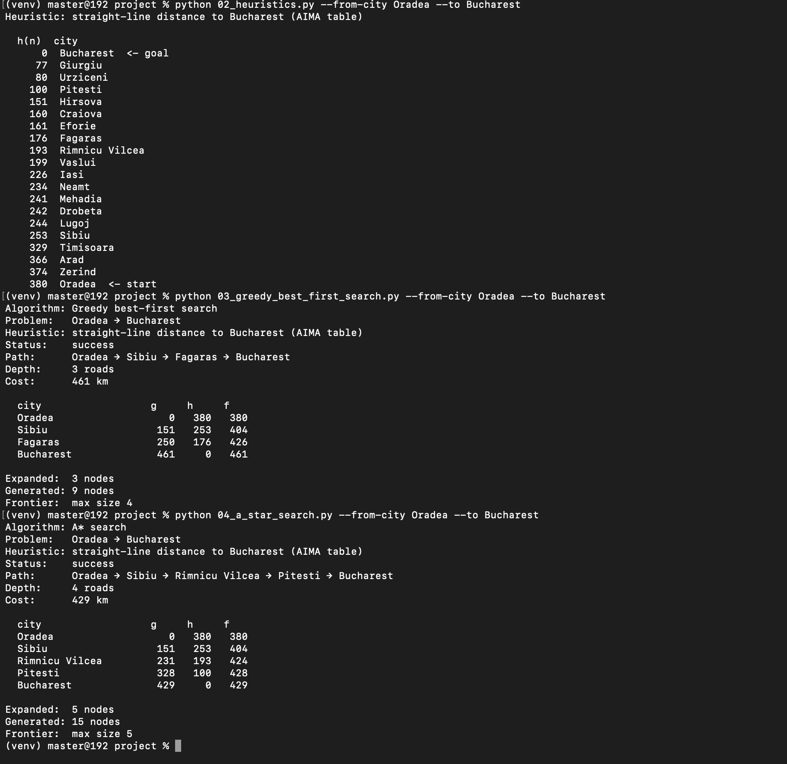
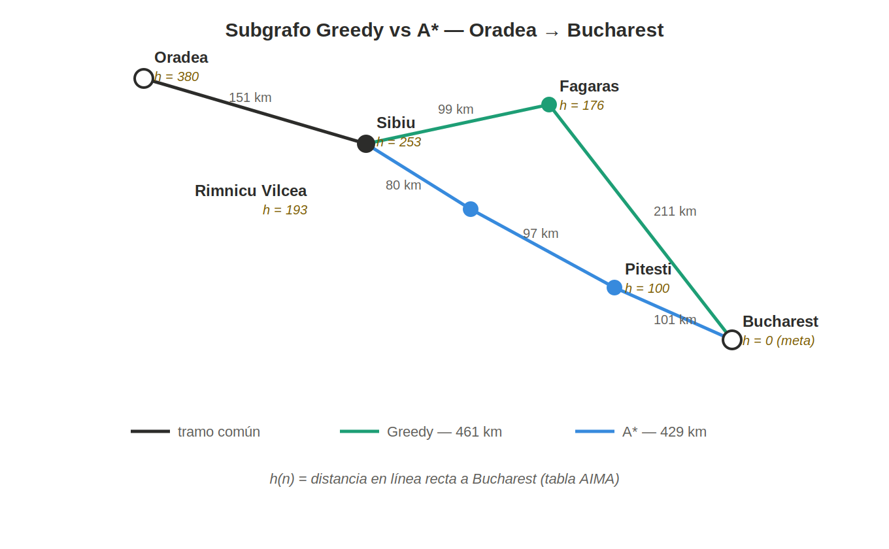

# Ejercicio 1 — Búsqueda informada: Oradea → Bucharest

## 1. Pareja origen–destino

**Oradea → Bucharest** (misma pareja usada en el ejercicio de Búsqueda no informada, para poder comparar resultados).

## 2. Heurística usada

Tabla AIMA de distancia en línea recta hacia Bucharest (admisible y consistente, ya que el destino es Bucharest).

| Ciudad | h(n) |
|---|---|
| Bucharest (meta) | 0 |
| Pitesti | 100 |
| Craiova | 160 |
| Fagaras | 176 |
| Rimnicu Vilcea | 193 |
| Mehadia | 241 |
| Drobeta | 242 |
| Lugoj | 244 |
| Sibiu | 253 |
| Timisoara | 329 |
| Arad | 366 |
| Zerind | 374 |
| Oradea (origen) | 380 |

## 3. Tabla comparativa

| Algoritmo | Status | Path | Depth | Cost (km) | Expanded | Generated |
|---|---|---|---|---|---|---|
| Greedy | success | Oradea → Sibiu → Fagaras → Bucharest | 3 | 461 | 3 | 9 |
| A* | success | Oradea → Sibiu → Rimnicu Vilcea → Pitesti → Bucharest | 4 | 429 | 5 | 15 |

## 4. Traza g / h / f

**Greedy** (ordena solo por h):

| Ciudad | g | h | f |
|---|---|---|---|
| Oradea | 0 | 380 | 380 |
| Sibiu | 151 | 253 | 404 |
| Fagaras | 250 | 176 | 426 |
| Bucharest | 461 | 0 | 461 |

**A\*** (ordena por f = g + h):

| Ciudad | g | h | f |
|---|---|---|---|
| Oradea | 0 | 380 | 380 |
| Sibiu | 151 | 253 | 404 |
| Rimnicu Vilcea | 231 | 193 | 424 |
| Pitesti | 328 | 100 | 428 |
| Bucharest | 429 | 0 | 429 |

## 5. Reporte (media página)

1. **¿A\* encontró el camino de menos km? ¿Greedy coincidió o se desvió?**

   Greedy no coincidió con A* — se desvió hacia un camino más caro (461 km). Sin embargo, cada uno cumplió con su propio criterio: Greedy por elegir siempre la menor heurística h(n) sin considerar el costo ya recorrido, y A* por elegir la menor f(n) = g(n) + h(n), es decir, considerando tanto lo recorrido como lo estimado — por eso sí encontró el camino de menos km (429 km), igual que UCS.

2. **¿Por qué Greedy puede devolver un camino más caro aunque `h` sea admisible?**

   Porque Greedy elige únicamente por la menor h(n) en cada paso, sin considerar cuánto ya le costó llegar ahí (g(n)). Al preferir Fagaras (h=176) sobre Rimnicu Vilcea (h=193) solo por tener menor heurística, no consideró que el tramo Fagaras→Bucharest era muy caro (211 km), y terminó con una ruta más cara en total que si hubiera tomado en cuenta el costo acumulado, como sí hace A*.

3. **En el camino de A\*, ¿`f` tiende a no disminuir a lo largo de la ruta? Relaciónalo con que `h` sea consistente.**

   f tiene una tendencia creciente (o igual) a lo largo del camino, porque conforme avanzamos, g aumenta con el costo real de cada carretera, mientras que h disminuye — pero nunca disminuye más de lo que esa carretera costó realmente. Esto es justamente lo que garantiza que h sea consistente: en cada paso, el "ahorro" que promete la heurística nunca es mayor al costo real del tramo recorrido, por lo que f = g + h nunca puede bajar.

## 6. Evidencia — Terminal (Oradea → Bucharest)

Captura de terminal (Greedy y A*):



Diagrama del subgrafo con h(n):



Transcripción en texto (heurísticas, Greedy, A*):

```
$ python 02_heuristics.py --from-city Oradea --to Bucharest
Heuristic: straight-line distance to Bucharest (AIMA table)

  h(n)  city
      0  Bucharest  <- goal
     77  Giurgiu
     80  Urziceni
    100  Pitesti
    151  Hirsova
    160  Craiova
    161  Eforie
    176  Fagaras
    193  Rimnicu Vilcea
    199  Vaslui
    226  Iasi
    234  Neamt
    241  Mehadia
    242  Drobeta
    244  Lugoj
    253  Sibiu
    329  Timisoara
    366  Arad
    374  Zerind
    380  Oradea  <- start

$ python 03_greedy_best_first_search.py --from-city Oradea --to Bucharest
Algorithm: Greedy best-first search
Problem:   Oradea → Bucharest
Heuristic: straight-line distance to Bucharest (AIMA table)
Status:    success
Path:      Oradea → Sibiu → Fagaras → Bucharest
Depth:     3 roads
Cost:      461 km

  city                  g     h     f
  Oradea                   0   380   380
  Sibiu                  151   253   404
  Fagaras                250   176   426
  Bucharest              461     0   461

Expanded:  3 nodes
Generated: 9 nodes
Frontier:  max size 4

$ python 04_a_star_search.py --from-city Oradea --to Bucharest
Algorithm: A* search
Problem:   Oradea → Bucharest
Heuristic: straight-line distance to Bucharest (AIMA table)
Status:    success
Path:      Oradea → Sibiu → Rimnicu Vilcea → Pitesti → Bucharest
Depth:     4 roads
Cost:      429 km

  city                  g     h     f
  Oradea                   0   380   380
  Sibiu                  151   253   404
  Rimnicu Vilcea         231   193   424
  Pitesti                328   100   428
  Bucharest              429     0   429

Expanded:  5 nodes
Generated: 15 nodes
Frontier:  max size 5
```

*(Complementar con el screenshot completo de la terminal.)*
