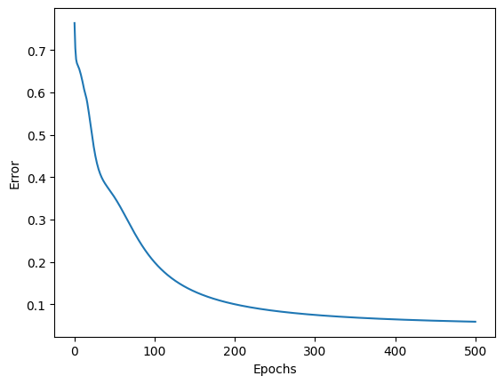
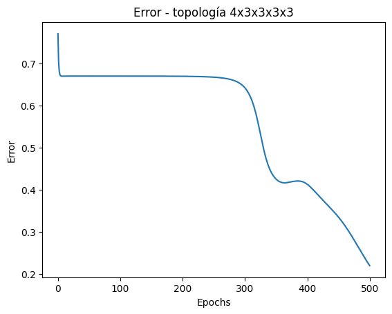
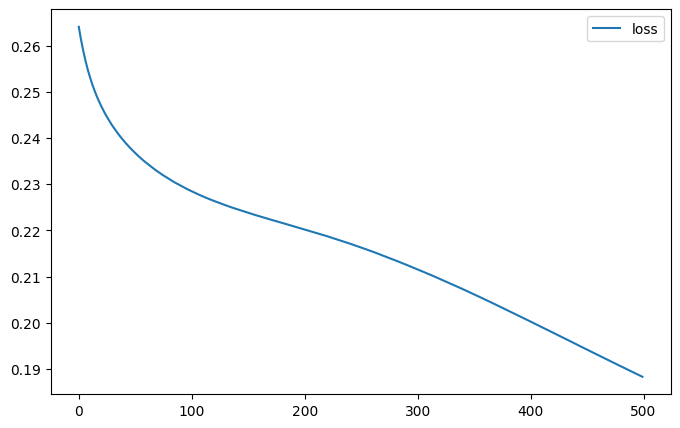
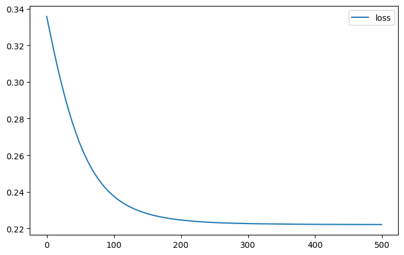
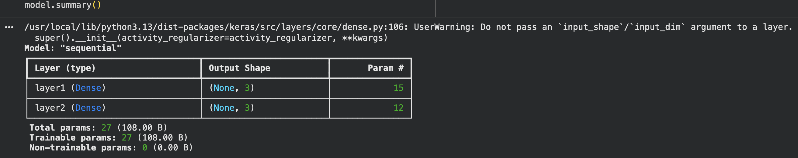
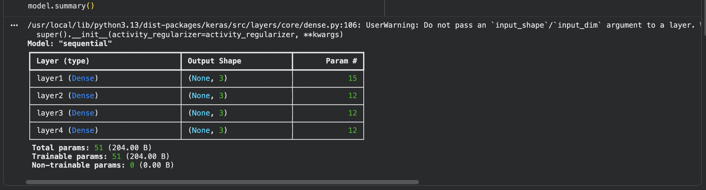
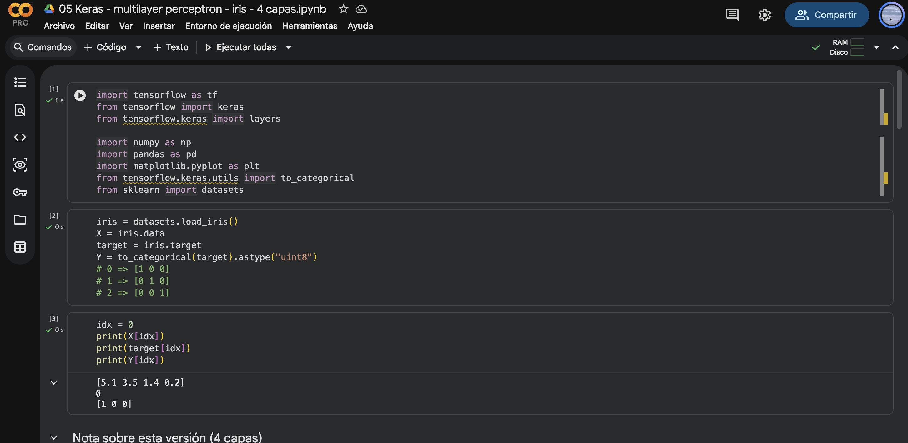

# Ejercicio 1 — Más capas en el perceptrón multicapa (Iris)

**Nombre:** Pamela C. Benítez M.
**Curso:** Introducción a la IA — Perceptrón multicapa

## 1. Metodología

Se corrieron en Google Colab las dos notebooks del curso (implementación a mano en NumPy y en Keras) con la topología original 4×3×3 para clasificar las 3 especies del dataset Iris. Después, se amplió cada red a 4 capas (topología 4×3×3×3×3, agregando dos capas ocultas), actualizando en la notebook NumPy el forward, `calculate_error` y el ciclo completo de backpropagation (no solo la inicialización de pesos). Ambas versiones profundas se reentrenaron con los mismos hiperparámetros que la original: activación sigmoide, error MSE, SGD con η=0.03, 500 épocas.

## 2. Resultados

| | NumPy — 2 capas | NumPy — 4 capas | Keras — 2 capas | Keras — 4 capas |
|---|---|---|---|---|
| Topología | 4×3×3 | 4×3×3×3×3 | 4×3×3 | 4×3×3×3×3 |
| Error/loss inicial | 0.70 | 0.77 | 0.264 | 0.336 |
| Error/loss final (época 500) | **0.06** | **0.22** | **0.188** | **0.222** |
| Comportamiento de la curva | Baja rápido, meseta corta (~50-150) | Meseta larga (~0-300 épocas casi planas), luego cae | Desciende de forma continua, sin aplanarse del todo | Desciende rápido y se estanca (~150-200) |
| Actualizaciones de peso/época | 150 (una por muestra) | 150 | 5 (batch_size=32 por defecto) | 5 |
| Parámetros totales | — | — | 27 | 51 |
| η / épocas / activación / error | 0.03 / 500 / sigmoide / MSE (igual en las 4 corridas) | | | |

**Curva NumPy — 2 capas (original):**

**Curva NumPy — 4 capas:**

**Curva Keras — 2 capas (original):**

**Curva Keras — 4 capas:**

**`model.summary()` — Keras 2 capas (27 parámetros):**

**`model.summary()` — Keras 4 capas (51 parámetros):**

## 3. Análisis

### 3.1 ¿Bajó más el error al añadir dos capas, o se estancó/empeoró? ¿Igual en NumPy y en Keras?

En ambas implementaciones, agregar dos capas ocultas **empeoró** el resultado final después de las mismas 500 épocas: en NumPy el error terminó casi 4 veces más alto (0.06 → 0.22) y en Keras subió de forma más moderada pero consistente (0.188 → 0.222). La dirección del efecto es la misma en las dos implementaciones, aunque la magnitud del deterioro no es idéntica — lo cual es esperable, dado que NumPy y Keras entrenan de forma distinta (ver 3.2). Lo relevante es que, dentro de cada implementación, la red más profunda quedó consistentemente peor que su propia versión de 2 capas.

### 3.2 ¿Las curvas de la notebook 01 y de Keras se parecen con la misma topología? Si no, ¿qué diferencias de implementación podrían explicarlo?

No se parecen en escala ni en velocidad de descenso, incluso con la misma topología. La diferencia principal identificada es el número de actualizaciones de peso por época: la notebook NumPy implementa SGD "puro", actualizando los pesos después de cada uno de los 150 ejemplos (150 actualizaciones/época), mientras que `model.fit()` de Keras agrupa los datos en lotes de 32 por defecto (`batch_size` no especificado), haciendo solo 5 actualizaciones por época. Esto por sí solo explica gran parte de por qué la curva de NumPy desciende mucho más rápido en el mismo número de épocas: recibe 30 veces más correcciones. Otra fuente posible de diferencia es el esquema de inicialización de pesos (uniforme manual en NumPy vs. inicialización Glorot por defecto en las capas `Dense` de Keras), aunque no se investigó a profundidad en este ejercicio.

### 3.3 Con sigmoides apiladas y MSE, ¿tiene sentido que una red más profunda no aprenda mejor en Iris? Relación con las gráficas

Sí tiene sentido, y las gráficas lo muestran de forma directa. En backpropagation, el delta de cada capa oculta se calcula multiplicando por la derivada de la sigmoide (que tiene un valor máximo de 0.25) y por los deltas de la capa siguiente. Al apilar más capas sigmoide, ese producto se repite más veces antes de llegar a las primeras capas, encogiendo la señal de corrección — el clásico problema del gradiente que se desvanece. Esto se ve con claridad en la curva de NumPy de 4 capas: hay una meseta de casi 300 épocas donde el error prácticamente no se mueve, mucho más larga que la meseta de ~100 épocas de la versión de 2 capas. Adicionalmente, Iris es un problema pequeño (150 ejemplos) y casi linealmente separable entre pares de clases, por lo que no requiere la capacidad extra de una red profunda; en este caso, las capas adicionales solo añaden costo de entrenamiento sin ninguna ganancia que lo compense.

## 4. Conclusión

Agregar capas no garantiza mejor desempeño — en este experimento lo empeoró en ambas implementaciones. El resultado es consistente con el fenómeno del gradiente que se desvanece al apilar activaciones sigmoide, agravado por el hecho de que Iris es un problema simple que no necesita esa profundidad adicional.

## 5. Evidencias

- Notebook NumPy original (2 capas): https://colab.research.google.com/drive/1udz9TKdb0lvAIdgt7M7DGdDdppc3Tujx
- Notebook NumPy profunda (4 capas): https://colab.research.google.com/drive/11L90QPqPnD5V05uDO9lNY6DQR3VguDzu
- Notebook Keras original (2 capas): https://colab.research.google.com/drive/1sHlvnqHl_v_PvlaqOCi8w7P0tAnrHAnR
- Notebook Keras profunda (4 capas): https://colab.research.google.com/drive/1mPwA3VSS7g79hAgIhQJSAj7g0YBUas1R
- Capturas de las 4 curvas de error/pérdida y de los dos `model.summary()` de Keras: *(adjuntar)*
**Captura del entorno Colab:**

