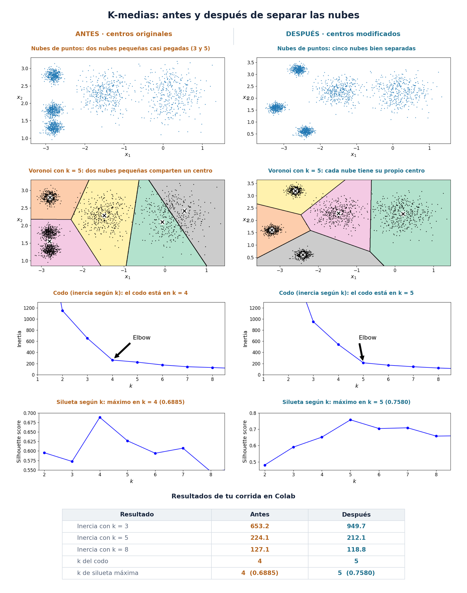
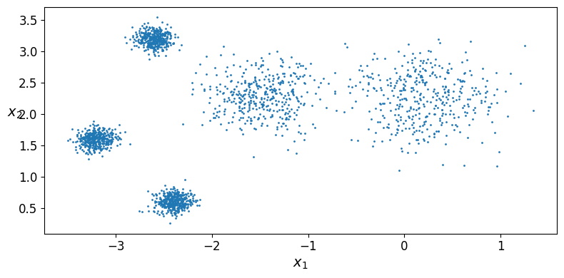
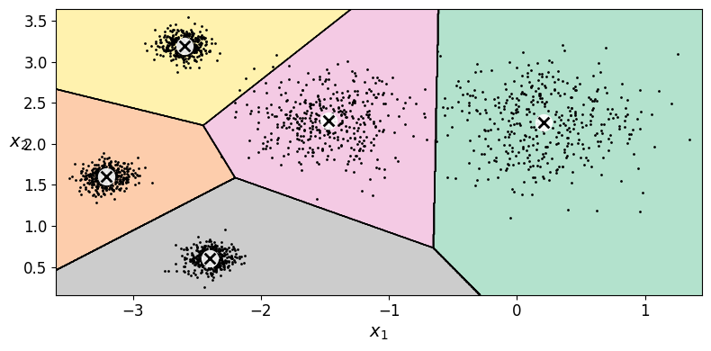
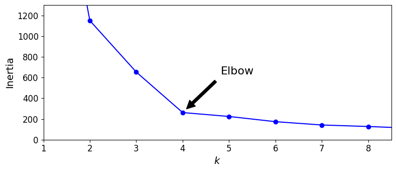
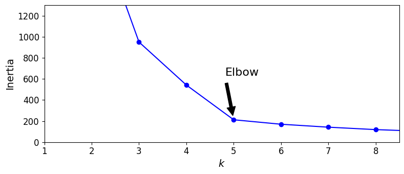
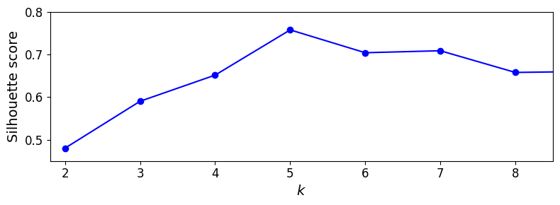

# Ejercicio 1 — Separar los blobs y volver a elegir k (k-medias)

**Nombre:** Pamela C. Benítez M.
**Curso:** Introducción a la IA — Clustering k-medias

## 1. Metodología

Se corrió en Google Colab, sobre una copia, la notebook `01 K-medias.ipynb` del curso. Primero se ejecutó sin modificar `blob_centers` ni `blob_std` (5 nubes gaussianas, `n_samples=2000`, `random_state=7`) y se anotó el k que sugieren el codo (inercia) y la silueta. Después se cambió un solo elemento: los centros de las nubes 3, 4 y 5, las tres de la izquierda. Las nubes 1 y 2 y las cinco desviaciones quedaron igual. Se volvió a correr desde `make_blobs` el ajuste de `KMeans`, el diagrama de Voronoi, el codo y la silueta, con los mismos hiperparámetros (bucle `kmeans_per_k` con k = 1, …, 9).

**Centros originales (Géron):**

```python
blob_centers = np.array(
    [[ 0.2,  2.3],
     [-1.5 ,  2.3],
     [-2.8,  1.8],
     [-2.8,  2.8],
     [-2.8,  1.3]])
blob_std = np.array([0.4, 0.3, 0.1, 0.1, 0.1])
```

**Centros modificados:**

```python
blob_centers = np.array(
    [[ 0.2,  2.3],
     [-1.5,  2.3],
     [-3.2,  1.6],
     [-2.6,  3.2],
     [-2.4,  0.6]])
blob_std = np.array([0.4, 0.3, 0.1, 0.1, 0.1])
```

Dos ajustes de graficado en la corrida modificada: la flecha "Elbow" está escrita a mano en el código de la notebook (en la figura original apunta a k = 4), por lo que en la figura modificada se movió a k = 5 (`xy=(5, inertias[4])`) después de leer el codo en la tabla de caídas de inercia. Además, en la figura de la silueta se amplió el eje vertical a 0.45–0.8 (`plt.axis([1.8, 8.5, 0.45, 0.8])`), porque con el rango original (0.55–0.7) se recortaba el máximo; por eso los ejes de las dos figuras de silueta no son iguales.

## 2. Resultados



| | Original | Modificado |
|---|---|---|
| Inercia con k = 3 | 653.2 | 949.7 |
| Inercia con k = 5 | 224.1 | 212.1 |
| Inercia con k = 8 | 127.1 | 118.8 |
| k del codo | **4** | **5** |
| k de silueta máxima | **4** (0.6885) | **5** (0.7580) |

**Inercia según k** (salida de la celda de impresión de `kmeans_per_k`):

| k | 1 | 2 | 3 | 4 | 5 | 6 | 7 | 8 | 9 |
|---|---|---|---|---|---|---|---|---|---|
| Original | 3534.8 | 1149.9 | 653.2 | 261.8 | 224.1 | 173.9 | 141.8 | 127.1 | 109.9 |
| Modificado | 4509.9 | 2195.9 | 949.7 | 541.9 | 212.1 | 169.8 | 141.9 | 118.8 | 102.8 |

**Cuánto baja la inercia al pasar de k − 1 a k:**

| k | 2 | 3 | 4 | 5 | 6 | 7 | 8 | 9 |
|---|---|---|---|---|---|---|---|---|
| Original | 2385 | 497 | 391 | **38** | 50 | 32 | 15 | 17 |
| Modificado | 2314 | 1246 | 408 | **330** | 42 | 28 | 23 | 16 |

**Silueta según k:**

| k | 2 | 3 | 4 | 5 | 6 | 7 | 8 | 9 |
|---|---|---|---|---|---|---|---|---|
| Original | 0.5954 | 0.5724 | **0.6885** | 0.6268 | 0.5940 | 0.6074 | 0.5459 | 0.5536 |
| Modificado | 0.4801 | 0.5903 | 0.6518 | **0.7580** | 0.7043 | 0.7090 | 0.6580 | 0.6605 |

**Nubes de puntos:**

| Original | Modificado |
|---|---|
|  |  |

**Diagrama de Voronoi con k = 5:**

| Original | Modificado |
|---|---|
|  |  |

**Codo (inercia según k):**

| Original | Modificado |
|---|---|
|  |  |

**Silueta según k:**

| Original | Modificado |
|---|---|
|  |  |

## 3. Análisis

### 3.1 En los datos de Géron, ¿por qué el codo prefiere k = 4 si `make_blobs` usó 5 centros?

Porque dos de las cinco nubes, la 3 y la 5, están tan cerca que k-medias las trata casi como un solo grupo: sus centros están a 0.5 de distancia y las dos tienen desviación de 0.1, así que el hueco entre sus círculos de 2 desviaciones es de apenas 0.1. El diagrama de Voronoi con k = 5 lo muestra: esas dos nubes pequeñas comparten un mismo centro, y el quinto centro se usó para partir en dos la nube ancha de la derecha. Los números confirman que ese quinto grupo aporta muy poco: al pasar de 3 a 4 grupos la inercia baja 391, pero de 4 a 5 baja solo **38**. La silueta también alcanza su máximo en k = 4 (0.6885), de modo que ambos criterios coinciden en el mismo k, aunque no sea el número real de nubes.

### 3.2 Con los blobs separados, ¿el codo y la silueta coinciden en el mismo k? ¿Ese k es 5?

Sí, coinciden y ambos señalan k = **5**. En el codo, la inercia baja 330 al pasar de 4 a 5 grupos y solo 42 de 5 a 6, es decir, la mejora grande termina en 5. En la silueta, el máximo es **0.758** en k = 5, contra 0.652 en k = 4. También cambió la inercia con k = 4, que subió de 261.8 a 541.9: con las nubes separadas, juntar dos en un solo grupo cuesta mucho más. Cabe aclarar que la flecha "Elbow" de la figura la escribe el código a mano, por lo que el codo se identificó con la tabla de caídas de inercia y no con la flecha.

### 3.3 Si el codo sigue en 4, ¿qué falta mover (distancia entre centros vs. `blob_std`)?

En este caso el codo no siguió en 4, pero de haber sido así habría faltado alejar más los centros de las nubes que se mezclaban (o bajar su desviación), hasta que la distancia entre centros fuera claramente mayor que 2 × (σᵢ + σⱼ); para dos nubes con desviación de 0.1, más de 0.4. En los datos originales las nubes 3 y 5 estaban a 0.5, apenas por encima de ese límite, y por eso se confundían. En la versión modificada la distancia mínima entre los tres centros de la izquierda pasó a 1.28, y con eso el codo y la silueta se movieron a k = 5.

## 4. Conclusión

Que el codo y la silueta señalen el k correcto depende tanto del algoritmo como de la separación entre los datos. En las nubes originales dos grupos estaban tan cerca (a 0.5, con desviación de 0.1) que k-medias los trataba como uno y los dos criterios apuntaban a k = 4; al alejar los centros (distancia mínima de 1.28), ambos coincidieron en k = 5. K-medias no comete un error en los datos originales: solo distingue como grupos distintos a los que están suficientemente separados con respecto a su dispersión.

## 5. Evidencias

- Notebook en Colab (copia con la corrida modificada): https://colab.research.google.com/drive/1SYMJfkT-lsyZhb9rvBXVfMv09FLmAxMw?usp=sharing
- La corrida original está en las figuras `original_*` de la carpeta `figuras/`, guardadas antes de editar los centros.

**Captura del entorno Colab (salida ejecutada):**


**Captura de la dirección de Colab:**


